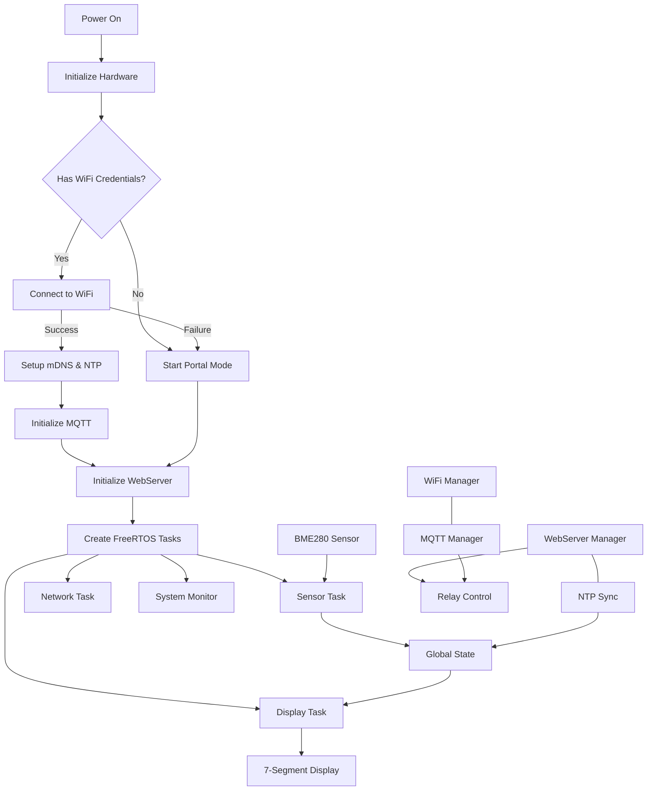
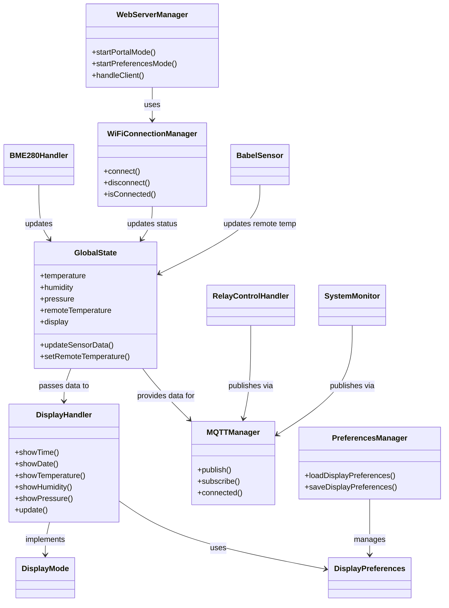
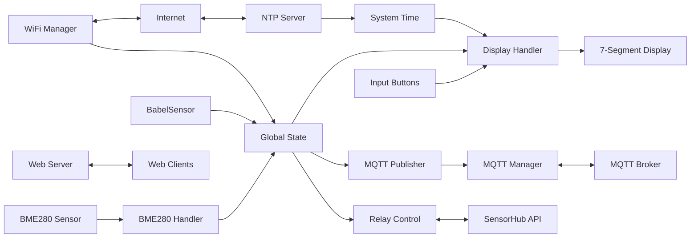
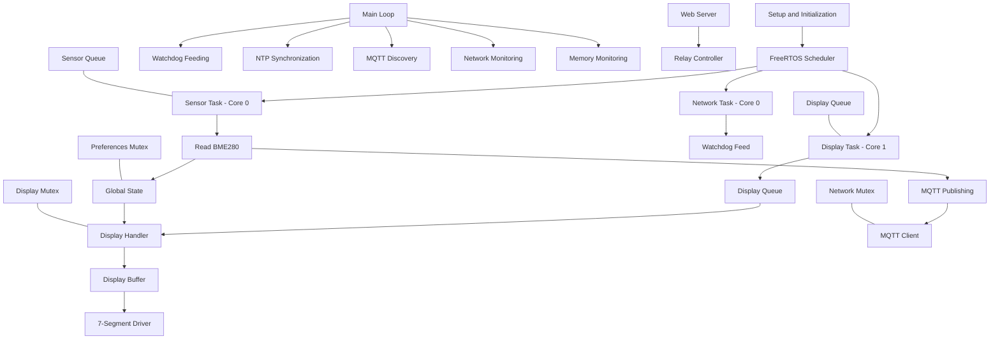
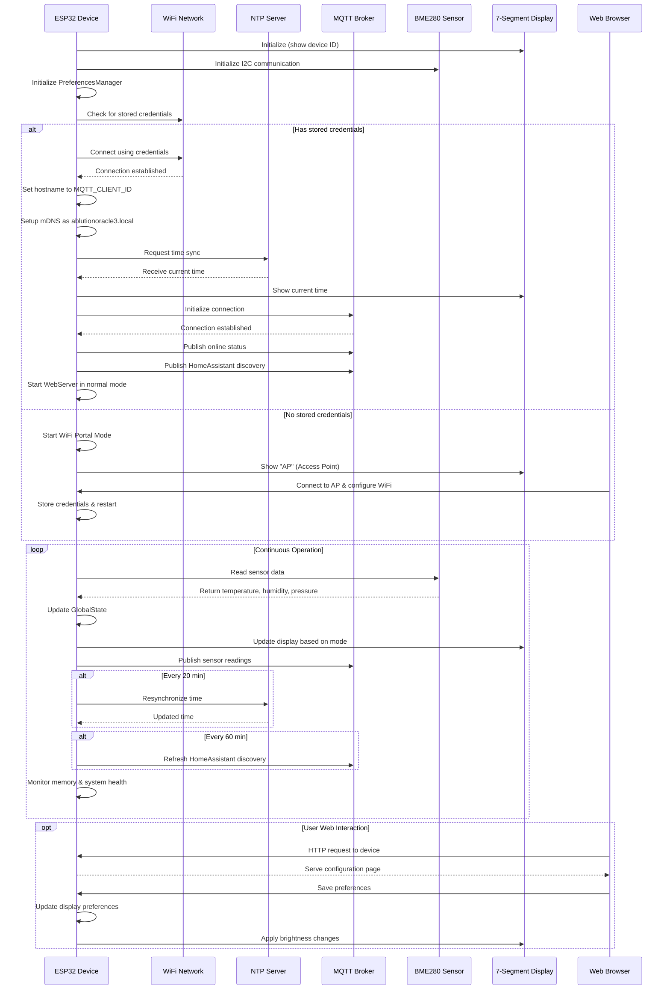

# A Smart Clock That Does More Than Just Tell Time

It all started with a cold shower—literally. After a few unpleasant surprises in the morning, I figured it would be useful to know before stepping in whether hot water was actually available elsewhere in the building. What began as a simple idea quickly spiraled (as these things tend to do) into a full-blown project.

The result? A smart and versatile clock that does more than just display the time. Alongside the current time and date, it also shows real-time temperature, humidity, and air pressure—both locally and from a remote sensor. Data is sent via an MQTT broker, but if the broker is unavailable, the sensorHUB reads the remote sensor directly. In other words, you’ll always get reliable readings, no matter what.

Under the hood, the system runs on FreeRTOS with a watchdog and task monitoring to keep things stable and robust. At one point, I considered adding news headlines to the display, but my housemates vetoed that idea—apparently, it was too much first thing in the morning.

Want to build one yourself? Or just curious about the code and design? Check out this project on GitHub! 

System architecture:



## Why This Codebase is Unique
- **Modular Design:** All functions are split into separate files (e.g., MQTTManager, BME280Handler, DisplayHandler) to ease maintainability and reusability.
- **Robust Connectivity:** Uses secure SSL connections to connect to the MQTT broker with built-in reconnection logic.
- **Dual Sensor Integration:** Supports both locally attached sensors and remote sensor data, offering flexibility in deployment.
- **Real-Time Tasks:** Implements multi-tasking using FreeRTOS, ensuring smooth operations even under heavy load.
- **OTA Friendly:** Ready for over-the-air (OTA) updates, making field upgrades seamless.
  
## Installation and Setup

### Prerequisites
- **Platform:** ESP32 development board. I used AZ-Deliviry ESP32 DEV C4.
- **Toolchain:** [PlatformIO](https://platformio.org/) or Arduino IDE with ESP32 support installed.
- **Libraries:**  
  - **Arduino.h:** Core Arduino library for ESP32.
  - **SPIFFS:** Filesystem library to manage onboard flash storage.
  - **Wire:** I2C communication for sensor interfacing.
  - **WiFi:** Library to manage WiFi connections.
  - **esp_task_wdt & esp_system:** For watchdog timer and system management.
  - **Time.h:** To manage NTP synchronization.
  - **Custom libraries:** GlobalState, DisplayHandler, BME280Handler, MQTTManager (found under `include/` and `src/` folders).
  
### Setup Instructions for a Fresh Compile
1. **Clone the Repository:**
   ```bash
   git clone https://github.com/yourusername/esp32-ota-test.git
   cd esp32-ota-test
   ```
2. **Configure PlatformIO or Arduino IDE:**
   - For **PlatformIO**: Open the project in [VS Code with PlatformIO extension](https://platformio.org/).
   - For **Arduino IDE**: Ensure ESP32 board support is installed via the Board Manager.
3. **Set Credentials:**
   - Edit the `config.h` file to update MQTT broker credentials, NTP server, timezone (TZ_INFO), and other configuration details.
4. **Build and Upload:**
   - With PlatformIO, run the build task and then upload the firmware to your ESP32 board.
   - With Arduino IDE, select the correct board/port and click Upload.

5. **Monitor as It Runs:**
   - Open the serial monitor (set to 115200 baud) to observe system initialization, connectivity logs, and sensor data publishing.

## Software architecture



## Data Flow Diagram


## FreeRTOS Task Architecture


## Device Startup and Communication Sequence


## How It Works
- **Global State Management:** Captures system-wide configurations and sensor data, ensuring synchronized operations.
- **Display Module:** Uses a dedicated FreeRTOS task to continuously update a physical display with digital clock and sensor data.
- **Sensor Reading:** The BME280 sensor is polled at intervals, and validated data (e.g., temperature, humidity, pressure) triggers MQTT publishing.
- **MQTT Connectivity:** The MQTTManager handles secure connections, reconnection strategies, and message publication with Last Will and Testament (LWT) for robust error handling.

## Challenges in Designing This Program & Library Choices

Developing this program came with some unexpected challenges. Initially, I used libraries I was already familiar with, along with code snippets I had happily reused from earlier projects. Everything was working smoothly—until I upgraded to a new Mac with Apple Silicon. Suddenly, some of my go-to libraries stopped working, painfully exposing the fact that they hadn’t been actively maintained for years.

Since I work on many different projects, I know that future me won’t always remember why I made certain choices. To help both myself and others who might be interested in this project, I’ve included a detailed description of the libraries used.

## What is ready and what is still left tot do:

- **OTA Implementaion:** Not yet implemented is OTA updates, making field upgrades seamless.

## Library Choices: Why These?

Below, you’ll find a brief explanation of each library used in this project, along with the reasoning behind its selection. In some cases, the choice was dictated by compatibility—some of the more popular libraries weren’t supported on macOS with ARM architecture. Wherever that was the case, I’ve noted it.

• Arduino.h  
  - Serves as the fundamental core library for ESP32 projects. While many alternatives exist, Arduino.h is widely supported on macOS ARM via the ESP32 toolchain, ensuring compatibility and ease of development.

• SPIFFS  
  - Provides onboard flash filesystem support. We chose SPIFFS because it is stable on ESP32 and has a proven track record—alternatives like LittleFS have had compatibility issues on macOS ARM when using certain development toolchains.

• Wire  
  - Used for I2C communication, a standard for sensor interfacing. The Wire library is robust and is maintained as part of the Arduino core for ESP32, which works reliably on macOS ARM without the issues that some non-standard I2C libraries might face.

• WiFi  
  - Manages WiFi connections. The ESP32 WiFi library (built into the core package) is well-tested and optimized for the ESP32. It avoids potential pitfalls found in some third-party libraries that may not support macOS ARM builds as seamlessly.

• esp_task_wdt  
  - Implements the watchdog timer using ESP-IDF components. This library is chosen for its low-level integration with the ESP32 system, ensuring robust task monitoring and reliability on macOS ARM-based development systems.

• esp_system.h  
  - Provides various essential system-level functions for the ESP environment. This is a core part of the ESP-IDF and is used because it offers direct access to hardware features, and has ensured compatibility even when more popular alternatives might have issues on macOS ARM.

• time.h  
  - Manages time synchronization, such as for NTP operations. The standard time library is chosen since it is part of the underlying system libraries and works effectively across different architectures including macOS ARM.

• Custom Libraries (GlobalState, DisplayHandler, BME280Handler, MQTTManager)  
  - These are developed in-house to encapsulate application-specific functionality. Their modular design ensures that they integrate seamlessly with the ESP32 core libraries and avoid reliance on external libraries that might not have full support on macOS ARM architecture.

By carefully selecting these libraries, we ensured stability, performance, and compatibility—especially important since some of the more popular alternatives may face compatibility issues on macOS ARM systems.

## Contributing
Contributions are welcome! Please fork the repository and submit a pull request with your enhancements or bug fixes.

## License
This project is licensed under the BSD 3-Clause License (Modified), see LICENSE file in the root of this project folder.


# Happy coding!


